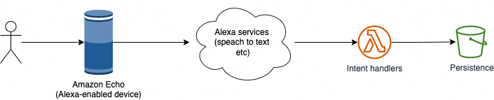

# Alexa Skill

This is an example project to develop a custom Alexa skill that will remember birthdays.

## How to use and interact with

Example:
> _"Alexa, open `remember-birthday` for X"_

where:
- Alexa = wake-word
- open = launch command (_alternatives: "start", "ask", "play"_)
- `remember-birthday` = invocation name (custom), one or more words, does not need to be unique
- for X / for {person} = utterance, what user's can say when they open/use a skill (the _'intent'_); the {person} name is a variable (or slot)

> Built-in intents: AMAZON.CancelIntent, AMAZON.StopIntent, AMAZON.HelpIntent, AMAZON.RepeatIntent

## Build

1. The intent
2. The code handling the intent

The interaction between the components involved in:
- capturing the command/speach,
- speach-to-text processing (NLP etc)
- analyzing the text for commands, invocations, utterances etc and passing the context to backend
- responding to the request & persisting data
looks something like: 

## Test

Via developer-console:
> Me: open `remember birthday`  
> Alexa: _Who's birthday would you like to save?_  
> Me: Joe  
> Alexa: _What date was joe born?_  
> Me: `march 12th 1989`  
> Alexa: _Could you confirm you want to save joe 's birthday as 1989-03-12 ?_  
> Me: yes  
> Alexa: _Saved joe's birthday!_  

## Next

- Validators
- Persistence
- Read-back commands
- Separate deployment of the backend (lambda code, deployment, hosting etc)

## References

- https://developer.amazon.com/en-US/alexa/alexa-skills-kit/get-deeper/custom-skills
- https://developer.amazon.com/en-US/docs/alexa/workshops/build-an-engaging-skill/get-started/index.html
